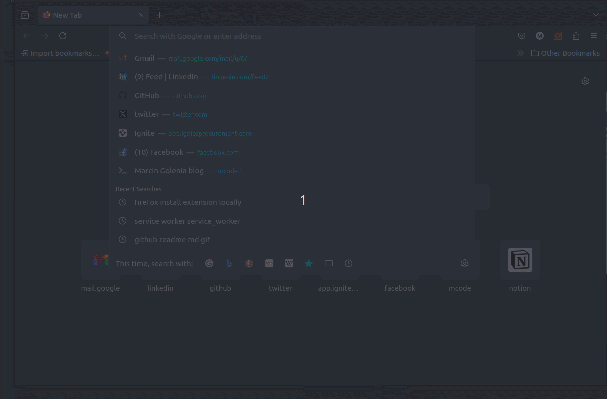

# paste-placeholder
Simple extension (ts, vite) that pastes inputs placeholder values on the entire page in the active tab. Works in chrome and firefox after a small change.

# Chrome 


# Firefox
1st you will have to make one change in the `manifest.json`:
```json
"background": {
    "service_worker": "background.js"
}
```
to 
```json
"background": {
    "scripts": ["background.js"]
}
```
then you can install it: 
